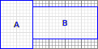

# Лабораторная работа №3 (widgets)

## Содержание

1. [Содержание](#содержание)
1. [Задание](#задание)
    1. [Советы](#советы)
1. [Требования к корректности решения](#требования-к-корректности-решения)
    1. [Базовые требования](#базовые-требования)
    1. [Дополнительные требования](#дополнительные-требования)
    1. [Частичные решения](#частичные-решения)
    1. [Метод `child_at`](#метод-child_at)
    1. [Виджет `ball_icon`](#виджет-ball_icon)
    1. [Контейнер `box`](#контейнер-box)
    1. [Контейнер `grid`](#контейнер-grid)
    1. [Метод `parent`](#метод-parent)
1. [Инструкция по сдаче](#инструкция-по-сдаче)
1. [Система оценки](#система-оценки)
1. [Сроки сдачи](#сроки-сдачи)

## Задание
Реализуйте недостающие классы и методы в игрушечной иерархии [виджетов](https://ru.wikipedia.org/wiki/%D0%AD%D0%BB%D0%B5%D0%BC%D0%B5%D0%BD%D1%82_%D0%B8%D0%BD%D1%82%D0%B5%D1%80%D1%84%D0%B5%D0%B9%D1%81%D0%B0).

Все виджеты наследуются от базового класса `widget`.
Некоторые виджеты представляют собой простые элементы: кнопку с надписью (`button`) или иконку шарика (`ball_icon`).
Другие виджеты являются *контейнерами*: они наследуются от класса `container` и могут содержать внутри себя любые виджеты.
Разные контейнеры располагают дочерние виджеты разным образом.
Контейнер владеет своими дочерними виджетами, а каждый дочерний виджет знает родительский виджет.

Все виджеты в конце концов оказываются на экране.
У каждого виджета есть его bounding box — минимальный ограничивающий прямоугольника с осями, параллельными осям координат.
Можно узнать его размеры в пикселях методами `width()` и `height()`.
Такой виджет занимает ровно `width() * height()` квадратных пикселей на экране.
Виджет может иметь один нулевой размер и один ненулевой — тогда он не занимает пиксели на экране,
но всё ещё может влиять на расположение остальных виджетов.

Контейнеры устроены так, что ограничивающие прямоугольники любых двух виджетов либо не пересекаются внутренностями,
либо целиком вложены и тогда один виджет является (пра)родителем другого.
Некоторые виджеты могут иметь "дырки": например, вокруг дочерних виджетов в контейнере
может быть пустое пространство.

Виджеты мутабельны: их свойства можно менять (надпись на кнопке, радиус шарика, набор дочерних виджетов в контейнере).
Размеры не-контейнеров обновляются автоматически при их изменении (например, текста на кнопке).
При этом если кто-то изменяет размер виджета в контейнере, то ему же
требуется пересчитать положения виджетов в родителе, вручную вызвав метод `update_layout()` у контейнера.
Например, при изменении текста на кнопке сам виджет `update_layout()` не вызывает.
Если изменять набор элементов в контейнере, он пересчитывает положения дочерних автоматически.

Можно было бы заставить виджет вызывать `update_layout()` у родителя, но хранение родителя у нас возникает только в последней подзадаче,
плюс это может быть не очень эффективно в ситуации, когда надо изменить много виджетов за один раз.

Точный интерфейс следует из тестов.

### Советы
* Ознакомьтесь с референсной реализацией виджетов в файлах `button.hpp` и `placeholder.hpp`.
* Перед тем, как делать очередное задание, найдите и поймите соответствующие ему тесты.
* Если класс не предназначен, чтобы от него наследовались дальше, помечайте его как `final`.
* Класс `container` может иметь смысл расширить защищёнными полями и методами, чтобы упростить реализацию наследников.
  * В частности, вам запрещается менять наследника `placeholder`.
* Если используется наследование, копирование обычно полностью теряет свой смысл.
  Запретите его в базовом классе, дописав туда специальный конструктор и оператор
  при помощи синтаксиса `= delete`:
  ```c++
  Base(const Base &) = delete;
  Base &operator=(const Base &) = delete;
  ```
* Если виртуальный метод не предназначен для перезаписи (то есть это уже финальная версия), помечайте его как `final`.
  * `final` требует, чтобы метод уже был виртуальным. Поэтому его необязательно помечать `override`: если он помечен только `final`, но не `virtual`/`override`, и никого не перезаписывает, это будет ошибка компиляции.
* Вы можете сделать не чисто виртуальную функцию в наследнике чисто виртуальной.
* Вместо `static_cast<Derived*>` можно использовать `dynamic_cast<Derived*>`: он проверит, что его параметр
  действительно указывает на `Derived` (или на наследника `Derived`).
  Если это не так — вернёт `nullptr`.
  Работает только если исходный класс имеет хотя бы одну виртуальную функцию (неважно, чистую или нет).
* Для размеров и координат используйте `int`, не `std::size_t`.
* Подумайте, как вы будете называть приватные и защищённые поля структур.
  Например, можно начинать вообще все поля с `m_` (от слова `member`).
* Если вам очень требуется какое-то неприватное поле, вы можете заглушить соответствующие предупреждения,
  смотри примеры в `placeholder.hpp`.
* Для метода `parent()` может пригодиться новая конструкция: `friend struct Bar;` внутри структуры `Foo` делает
  всю структуру `Bar` целиком другом `Foo`.
  В частности, все методы и поля `Bar` получают доступ к приватным полям и методам `Foo`.
* Так просто создать `vector<vector<unique_ptr<...>>> v(n, ...)` из пустых `unique_ptr` не получится.
  Конструктор от `(n, value)` у вектора создаёт `n` элементов и _копирует_ `value` в каждый.
  То есть вы на верхнем уровне пытаетесь _скопировать_ `vector<unique_ptr<...>>` в каждую из `n` строк.
  А для этого надо уметь копировать `unique_ptr`. А его копировать нельзя.
  Вот такое вот техническое ограничение: компилятор не знает, что внутри на самом деле пустой `unique_ptr`,
  который по смыслу копировать можно (по системе типов-то всё ещё нельзя).
  Так что надо написать не так красиво, в несколько строчек, чтобы компилятор чётко видел, что копирований нет.
* Оставляйте в `.hpp` в точности самые простые методы: из одной строчки, без инвариантов и без магических констант.
  Например, некоторые тривиальные геттеры и сеттеры.
* Храните минимальное количество полей, необходимых для достижения нужного времени работы.
* Из тестов следует, что `child_at` не может быть const-qualified по некоторым техническим причинам.
* Несмотря на то, что и `box` можно сделать в каком-то смысле эффективнее при помощи `multiset`
  (`O(log n)`/`O(log n)` на `add`/`remove` вместо `O(1)`/`O(n)`), этого не требуется.
  Также не стоит добавлять `multiset` в реализацию `grid`.

## Требования к корректности решения
### Базовые требования
Действуют [стандартные требования](../common/).

Программа должна занимать не более 500 строк (считаются ровно те файлы, что можно изменять).
Официальное решение занимает 373 строки.

### Дополнительные требования
* Вам разрешается менять только файлы `abstract_widgets.hpp`/`.cpp`, `ball_icon.hpp`/`.cpp`, `box.hpp`/`.cpp`, `grid.hpp`/`.cpp`,
  а также комментировать тесты в `test_utils.hpp`.
* В каждом `.cpp`-файле должен быть реализован хотя бы один метод из соответствующего заголовка.
  Также в каждом `.hpp`-файле должен быть реализован хотя бы один метод.
* В качестве тренировки конструкторы можно реализовывать только в `.cpp`-файлах.
* Класс `widget` и его наследники должны оставаться некопируемыми и неперемещаемыми.
* Ваше API должно быть невозможно случайно использовать некорректно.
  Например:
  * Если вы возвращаете владеющий указатель, вы должны возвращать `unique_ptr`,
    а не чистый указатель.
  * Не должно быть публичных методов, которые можно случайно вызвать и незаметно
    сломать инвариант.
* Методы `width()`/`height()`/`parent()` у любого виджета должны работать за константное время.
* Метод `child_at()` при вызове от пикселя за пределами ограничивающего прямоугольника (bounding box) должен работать за константное время.
  * Например, от отрицательных координат.
* Для любого виджета `struct foo` должен быть метод `make_foo(a, b, c)`, эквивалентный вызову `std::make_unique<foo>(a, b, c)`.
* Файлу `abstract_widgets.hpp` запрещено упоминать каких-либо наследников из других файлов (например, нельзя делать их друзьями)
  или предполагать, что наследников `widget`/`container`, кроме указанных в задании, нет.
* Считайте, что квадрат любых возникающих при разумных вычислениях координат помещается в `int` с запасом в несколько раз.

### Частичные решения
Вы можете реализовать любой префикс из пяти подзаданий ниже и получить частичные баллы:

1. [Метод `child_at`](#метод-child_at)
1. [Виджет `ball_icon`](#виджет-ball_icon)
1. [Контейнер `box`](#контейнер-box)
1. [Контейнер `grid`](#контейнер-grid)
1. [Метод `parent`](#метод-parent)

### Метод `child_at`
Метод `child_at(x, y)` позволяет узнать, какому виджету-не-контейнеру принадлежит пиксель `(x, y)`:
либо самому виджету, либо какому-нибудь из его детей (в том числе прадетей).
Координаты начинаются от левого верхнего угла виджета с нуля, ось OX растёт вправо, ось OY — вниз.
Обратите внимание, что нумеруются именно квадратные пиксели, а не точки на координатной плоскости.
Например, внутри виджета размером `1*1` имеется ровно один пиксель: `(0, 0)`.

Можно считать, что все виджеты без родителя (то есть не лежащие ни в каком контейнере) находятся в независимых координатных плоскостях и не пересекаются.
Никакого глобального экрана, на котором располагаются сразу все виджеты, нет; все координаты задаются относительно текущего виджета (даже если он лежит в каком-то контейнере).

Если пиксель находится внутри какого-либо дочернего виджета-не-контейнера (включая `this`, если он не контейнер),
то возвращается невладеющий указатель на этот виджет-не-контейнер.
Иначе возвращается `nullptr`.
Таком образом, `child_at` никогда не возвращает указатель на виджет-контейнер.

В общем случае виджет имеют прямоугольную форму (например, кнопка), поэтому разумно предоставить реализацию по умолчанию.

В этом подзадании вам также может потребоваться добавить ещё что-то, кроме метода `child_at`.
Выданный код на самом деле не совсем корректен.

### Виджет `ball_icon`
Виджет `ball_icon` соответствует одной круглой иконке-шарику радиусом `radius` квадратных пикселей.
Соответственно, ширина и высота этой иконки — `2 * radius + 1` пиксель.

Таким образом можно однозначно определить центральный квадратный пиксель.
Метод `child_at(x, y)` возвращает `this`, если евклидово расстояние от искомого пикселя до центрального не превышает радиус иконки.
Например, пиксели `(0, radius)` и `(2 * radius, radius)` принадлежат иконке, а вот `(0, 2 * radius + 1)` — уже нет.

Помимо унаследованных методов у `ball_icon` имеются два:

* `radius()` возвращает текущий радиус.
* `radius(new_radius)` изменяет радиус на `new_radius`.

### Контейнер `box`
Работает почти как [`QBoxLayout`](https://doc.qt.io/qt-6/qboxlayout.html):

* В конструкторе фиксируется вид `box`: горизонтальный (элемент перечисления `box::kind::HORIZONTAL`) или вертикальный (`box::kind::VERTICAL`).
  Этот вид поменять нельзя.
* Все дочерние элементы упорядочены и пронумерованы с нуля.
* Горизонтальный `box` рисует свои элементы слева направо вплотную друг к другу ограничивающими
  прямоугольниками (даже если элементы можно сдвинуть ещё плотнее из-за сложной формы элементов).
  Таким образом его ширина равна сумме `width()` элементов, а высота — `height()` максимального элемента.
  Элементы меньшей высоты выравниваются посередине с округлением вверх по экрану (в сторону уменьшения координаты Y).
  Вертикальный `box` работает аналогично, округление влево по экрану (в сторону уменьшения координаты X).
* `box` без элементов имеет размер 0x0 пикселей.
* Считаем, что пиксели `box` — в точности объединение пикселей всех его дочерних элементов.
  То есть метод `child_at()` может вернуть `nullptr` даже внутри ограничивающего прямоугольника, если не попасть в дочерний элемент.

`box` наследуется от класса `container`, у которого есть метод `update_layout()`.
Этот метод заставляет контейнер обойти своих детей (нерекурсивно) и пересчитать свою высоту и ширину.

Помимо унаследованных методов у `box` имеются методы (здесь `n` — количество дочерних элементов):

* `size()` — возвращает количество дочерних элементов (`int`) за `O(1)`.
* `get(index)` — возвращает невладеющий указатель на дочерний элемент с номером `index`
  (нумерация с нуля) за `O(1)`.
* `add(child)` — добавляет в конец новый дочерний виджет `child` (гарантируется, что передают именно виджет, а не `nullptr`/`std::nullopt`/etc).
  Возвращает невладеющий указатель на добавленный виджет.
  Работает за `O(1)`, можно амортизировано.
* `remove(index)` — удаляет дочерний элемент с номером `index`,
  возвращает владеющий указатель на удалённый элемент.
  Работает за `O(n)`, можно амортизировано.

Метод `update_layout()` работает за `O(n)`.
Метод `child_at()` работает за `O(n)` плюс время работы `child_at()` для не более чем одного ребёнка.
Подумайте, почему время работы может получиться экспоненциальным, если вызывать `child_at()` для ребёнка два раза.

Например, если поместить в горизонтальный `box` два виджета `A` и `B`, то пиксели могут распределиться так:



А если поместить один горизонтальный `box` (синий) из трёх элементов (красные) в низ вертикального `box` (фиолетовый), то может получиться так:


### Контейнер `grid`
Работает почти как [`QGridLayout`](https://doc.qt.io/qt-6/qgridlayout.html), но не так гибко:

* В конструкторе фиксируется количество строк (`rows`) и столбцов (`columns`) таблицы.
  Это количество поменять нельзя.
* В каждой ячейке таблицы может непосредственно находиться не более одного дочернего элемента.
  При этом этот дочерний элемент может быть контейнером со своими дочерними элементами.
* Все ячейки рисуются в таблице без зазоров.
  Каждая строка/столбец принимает минимально возможный размер, чтобы поместились все элементы.
  В частности, строки/столбцы без элементов имеют размер 0 пикселей.
* Если элемент меньше ячейки, то он выравнивается в левый верхний угол ячейки.
* Считаем, что пиксели `grid` — в точности объединение пикселей всех его дочерних элементов.
  То есть метод `child_at()` может вернуть `nullptr` даже внутри ограничивающего прямоугольника, если не попасть в дочерний элемент.

Помимо унаследованных методов у `grid` имеются методы (здесь `n` — количество дочерних элементов):

* `rows()`/`columns()` — возвращают количество строк/столбцов за `O(1)`.
* `get(row, column)` — возвращает невладеющий указатель на дочерний элемент в строке `row` и столбце `column`
  (нумерация с нуля) за `O(1)`.
  Если такого элемента нет, возвращает `nullptr`.
* `add(child, row, column)` — добавляет новый дочерний виджет `child` в строку `row` и столбец `column`.
  Гарантируется, что передают именно существующий `widget`.
  Старый элемент из этой ячейки удаляется.
  Возвращает невладеющий указатель на добавленный виджет.
  Работает за `O(rows+columns)`, можно амортизировано.
* `remove(row, column)` — удаляет дочерний элемент из строки `row` и столбца `column`,
  возвращает владеющий указатель на удалённый элемент.
  Если такого элемента нет, возвращает `nullptr`.
  Работает за `O(rows+columns)`, можно амортизировано.

Метод `update_layout()` работает за `O(rows*columns)`.
Метод `child_at()` работает за `O(rows+columns)` плюс время работы `child_at()` для не более чем одного ребёнка.
Подумайте, почему время работы может получиться экспоненциальным, если вызывать `child_at()` для ребёнка два раза.

Пример таблицы с двумя строками, трёмя столбцами, и тремя элементами:


### Метод `parent`
Добавьте _невиртуальный_ метод `widget::parent()`, возвращающий невладеющий указатель на родительский виджет
при его наличии, `nullptr` иначе.

Значение этого метода должно автоматически меняться при вызове методов `add`/`remove` у контейнеров.
При этом должно быть невозможно случайно изменить `parent` без использования контейнера.
Например, публичный (`public`) или даже защищённый (`protected`) сеттер в `widget` не подойдёт:
так любой виджет сможет установить себе произвольного родителя.
Нужно что-то чуть-чуть хитрее и безопаснее, хотя 100% безопасности не достичь.

## Инструкция по сдаче
[Схема стандартная](../common/#формат-сдачи): вы должны выполнить
задание в отдельной ветке своего существующего закрытого репозитория в организации и в нём же создать Pull Request.
Никаких форков!
В этом задании должно хватить веб-интерфейса GitHub, если возникают проблемы — попросите практика помочь.

Если вы хотите сдать только некоторые части задания, закомментируйте строки вида `#define TEST_FOO`
для остальных частей в файле `test_utils.hpp`, чтобы отключить соответствующие автотесты.
Также может потребоваться изменить набор файлов в `cppcheck-suppressions.txt`, чтобы подавить
все предупреждения `unusedFunction` из файлов `*_test.cpp`, которые по факту возникают на сервере.
Или наоборот, перестать подавлять, если возникает предупреждение `unmatched suppression: unusedFunction`.

## Система оценки
[Схема стандартная](../common/#система-оценки), баллы:

|Выполненные части|Макс. корректность|Макс. стиль|Макс. итог|
|---|---|---|---|
|1  |0.5|0.5| 1|
|1-2|1  |1  | 2|
|1-3|3  |2  | 5|
|1-4|5  |3  | 8|
|1-5|6  |4  |10|

## Сроки сдачи
Задание выдано 7 ноября 2024 (четверг).
Ниже в каждом случае указано московское время.

* **Дедлайн сдачи:** 17 ноября 2024 (воскресенье), **22**:59.
* Ожидаемый срок проверки: 24 ноября 2024 (воскресенье).
* Если первая попытка сдачи достаточно разумна (на усмотрение принимающего),
  то вы можете сделать ещё попытку исправлений или даже несколько.
    * Предложение актуально даже если вы получили автоматический ноль за первую попытку.
    * Выставляется максимум из всех попыток.
* **Срок исправлений**: 1 декабря 2024 (воскресенье).
