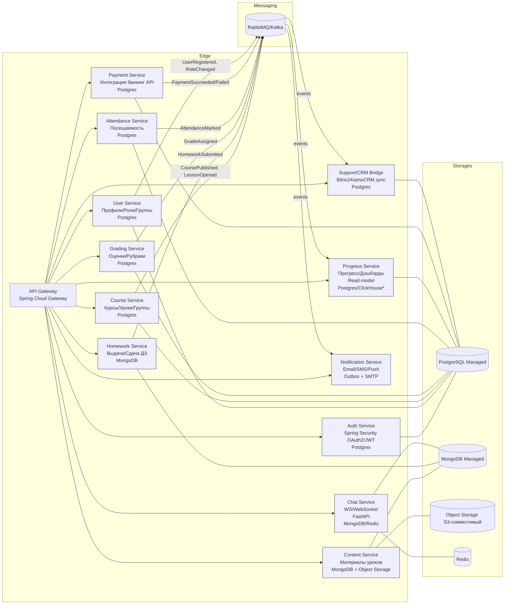
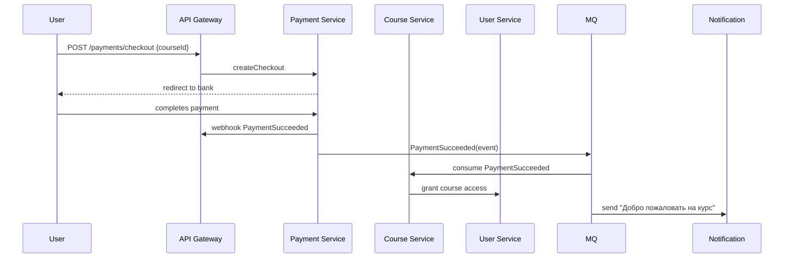
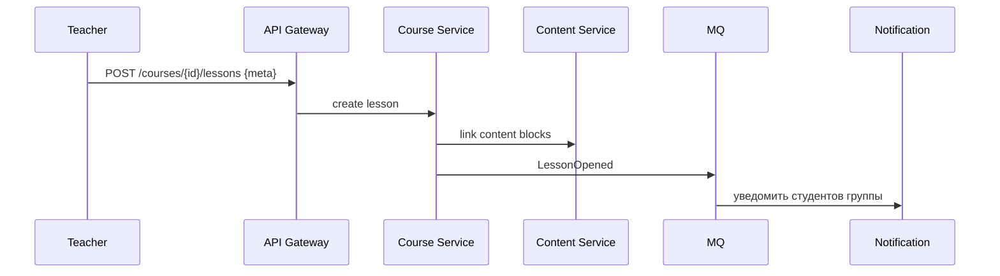
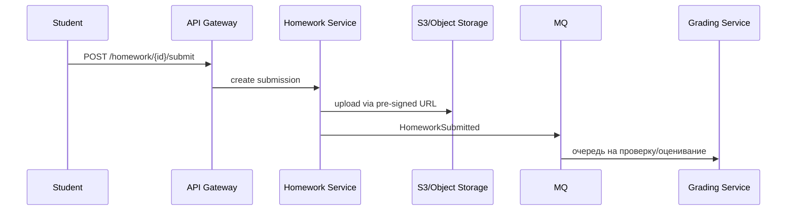

# Архитектура LMS (черновик)

> Цель: обучающая платформа на Spring Boot (+ частично FastAPI), БД PostgreSQL и MongoDB, файловое хранилище в облаке (Yandex Cloud/AWS), с CRM‑интеграцией, платежами и нотификациями. Ниже — карта сервисов, БД, очередей, а также ключевые сценарии и рекомендации по деплою.

---

## 1) Общая схема (мертеж)

\* *Примечание:* для аналитических сводок (прогресс по курсам, активность) можно рассмотреть ClickHouse в качестве OLAP‑хранилища или materialized views в Postgres.

---

## 2) Роли и доступы (RBAC)
- **STUDENT**: просмотр купленных курсов, материалы, сдача ДЗ, чат, прогресс.
- **TEACHER**: доступ ко всем своим курсам, открытие уроков, загрузка ДЗ, выставление оценок, отмечание посещаемости, модерирование чатов.
- **SUPPORT**: доступ ко всем курсам/пользователям в режиме read + спец‑операции (связь с родителями, CRM‑карточки), без права академических изменений.
- **PARENT**: доступ к отчетам ребёнка (оценки, посещаемость, уведомления).
- **ADMIN**: управление пользователями, тарифами, курсами, лимитами, интеграциями.

**Auth Service**: OAuth2 + JWT, refresh tokens, device tokens, MFA (по желанию).

---

## 3) Назначение сервисов и их БД
**API Gateway (Spring Cloud Gateway)**
- Точки входа REST/GraphQL/WebSocket, CORS, rate‑limit, circuit‑breaking.
- Проверка и проксирование JWT; привязка к Eureka/Consul/Static DNS.

**Auth Service (Postgres)**
- Пользовательские креды, refresh tokens, clients, роли/пермишены.
- SSO (Keycloak как альтернатива), password policies, audit лог.

**User Service (Postgres)**
- Профили пользователей, связи «ученик–родитель», группы, роли на курсах.
- Импорт/экспорт CSV, GDPR‑удаление, soft‑delete.

**Course Service (Postgres)**
- Каталог курсов, планы уроков, учебные группы, расписание.
- Публикации уроков (**LessonOpened** event), видимость по ролям.

**Content Service (MongoDB + S3/Object Storage)**
- Структурированные материалы: текст/markdown, вложенные блоки, квизы.
- Версионирование, предпросмотр, трансформация медиа (pre‑signed URLs).

**Homework Service (MongoDB)**
- Выдача заданий, дедлайны, аттачи в Object Storage, проверки на плагиат.*
- События **HomeworkSubmitted**.

**Grading Service (Postgres)**
- Оценивание по рубрикам, критерии, пересдачи, апелляции.
- События **GradeAssigned**.

**Attendance Service (Postgres)**
- Отметки посещаемости по занятиям, причины отсутствия, статусы.
- События **AttendanceMarked**.

**Progress Service (Postgres/ClickHouse)**
- Агрегации: выполненные уроки, средний балл, пропуски, активности.
- Подписан на события из MQ; строит read‑модель для быстрых дэшбордов.

**Chat Service (FastAPI + WS, MongoDB/Redis)**
- Каналы по группам, файловые вложения (S3), модерация, упоминания.
- Redis для pub/sub или хранения сессий WS.

**Notification Service**
- Outbox‑таблица + воркеры: письма, SMS, push. Шаблоны, локали, quiet hours.
- Триггеры: покупки, дедлайны, пропуски, новые уроки.

**Payment Service (Postgres)**
- Интеграция с платёжками (банки РФ/эквайринг), webhooks, статусы.
- События **PaymentSucceeded/Failed**, выдача доступа к курсам.

**Support/CRM Bridge (Postgres)**
- Синхронизация инцидентов/карточек в CRM (Bitrix24/amoCRM), SLAs.
- Доступ к контактам родителей, шаблоны звонков/писем, отчёты.

---

## 4) Событийная модель (event taxonomy)
- **UserRegistered / RoleChanged** — источник: User Service.
- **CoursePublished / LessonOpened** — Course Service.
- **HomeworkAssigned / HomeworkSubmitted** — Homework Service.
- **GradeAssigned** — Grading Service.
- **AttendanceMarked** — Attendance Service.
- **PaymentSucceeded / PaymentFailed** — Payment Service.

**Консументы:**
- Progress Service (строит агрегаты), Notification Service (шлёт письма), CRM Bridge (обновляет CRM‑карточки), возможно — антифрод.

**Шина:** RabbitMQ (проще для команд/ивентов) или Kafka (если нужны ретеншн/реплей и высокая пропускная способность).

---

## 5) Хранилища и почему
- **PostgreSQL** — строгие транзакции, FK, отчётность (курсы, оценки, посещаемость, платежи).
- **MongoDB** — гибкие документы для материалов уроков и ДЗ, быстрые вставки/чтение по ключу.
- **Object Storage (S3‑совместимый)** — видео/файлы/изображения (Yandex Object Storage / AWS S3). Pre‑signed URLs.
- **Redis** — кеш сессий, rate‑limits, pub/sub для чата, очереди задач малого объёма.
- **(Опц.) ClickHouse** — дешёвые и быстрые аналитические запросы по событиям.

---

## 6) Ключевые последовательности

### 6.1 Покупка курса и выдача доступа

### 6.2 Публикация урока преподавателем

### 6.3 Сдача домашней работы

---

## 7) Интеграции и внешние системы
- **CRM:** Bitrix24/amoCRM — через отдельный мост (webhooks + periodic sync). Логи ошибок, re‑try с механизмом outbox/inbox.
- **Платежи (РФ):** эквайринг Тинькофф/Сбер/ЮKassa/CloudPayments. Выбор по тарифам, поддержка webhooks, тестовые стенды.
- **Почта:** SMTP (Yandex 360/почтовый сервис), либо сторонний транзакционный провайдер.
- **Видео‑потоки:** интеграция с видео‑хостингом или собственный CDN (по желанию).

---

## 8) Сервис‑дискавери и конфигурация
- **Eureka** (Spring Cloud Netflix) — ок для dev/stage; для prod рассмотреть **Consul**/**Nacos**.
- **Config Server** (Spring Cloud Config) + Git репозиторий с конфигами, шифрование секретов (Vault).

---

## 9) Обсервабилити и надёжность
- **Логи:** ELK/EFK (Filebeat/Fluentd → Elasticsearch → Kibana) или OpenSearch.
- **Метрики:** Prometheus + Grafana; алерты.
- **Трейсинг:** OpenTelemetry + Jaeger/Tempo.
- **Resilience:** Circuit Breaker (Resilience4j), timeouts/retries, idempotency keys для платежей.
- **Тесты:** контрактные (Spring Cloud Contract), интеграционные (Testcontainers), e2e (Playwright).

---

## 10) Деплой, окружения и инфраструктура
- **Dev** — Docker Compose: Postgres, MongoDB, Redis, MQ, MinIO (локальный S3), все сервисы.
- **Prod** — Kubernetes (Yandex Managed K8s / AWS EKS). Ingress (Nginx), ExternalDNS, cert‑manager.
- **Managed‑сервисы:**
  - Yandex: Managed PostgreSQL, Managed MongoDB, Managed Kafka, Object Storage.
  - AWS: RDS (Postgres), MSK (Kafka), S3, ElastiCache (Redis), SES/SNS (почта/уведомления).
- **Секреты** — HashiCorp Vault / K8s Secrets + sealed‑secrets.

---

## 11) Минимальный MVP‑срез (чтобы быстро взлететь)
1. Auth + User + Course (+ Gateway).
2. Content (без версионирования, простые markdown/attachments через MinIO).
3. Payment (один провайдер), выдача доступа.
4. Homework + Grading (вручную/простое выставление).
5. Notification (только email) через outbox.
6. Простейший Progress (агрегаты в Postgres cron‑ом).

---

## 12) Структура репозиториев
- **polyrepo**: `lms-gateway`, `lms-auth`, `lms-user`, `lms-course`, `lms-content`, `lms-homework`, `lms-grading`, `lms-attendance`, `lms-progress`, `lms-chat`, `lms-notification`, `lms-payment`, `lms-crm-bridge`, `infra`.
- В каждом — Dockerfile, Helm chart (или один общий umbrella‑chart в `infra`).

---

## 13) Схемы БД (эскиз)

**Postgres (Course/User/Grade/Attendance/Payment)** — ключевые таблицы:
- `users(id, email, phone, password_hash, role, parent_id, created_at)`
- `courses(id, title, summary, teacher_id, price, status)`
- `lessons(id, course_id, title, published_at, visible_from)`
- `groups(id, course_id, title)`; `group_members(group_id, user_id, role)`
- `enrollments(id, user_id, course_id, status, started_at, expires_at)`
- `grades(id, user_id, lesson_id, score, rubric_id, comment)`
- `attendance(id, user_id, lesson_id, status, reason)`
- `payments(id, user_id, course_id, provider, amount, currency, status, external_id)`

**MongoDB (Content/Homework/Chat)** — коллекции:
- `contents` { lessonId, blocks:[{type, data}], attachments:[{key, name}] }
- `homework` { lessonId, tasks:[...] }
- `submissions` { homeworkId, userId, answers, attachments, submittedAt, status }
- `messages` { groupId, userId, text, attachments, createdAt }

---

## 14) Безопасность и соответствие
- GDPR/152‑ФЗ: право на удаление, экспорт, согласие на обработку.
- PII/PCI: токенизация платежей, не хранить PAN; webhooks с верификацией.
- RBAC+ABAC для тонкой видимости материалов и оценок.

---

## 15) Идеи на вырост
- Очные/онлайн расписания с интеграцией видеоконференций (Zoom/Meet).
- Бейджи/геймификация (ачивки, уровни, лидборды) — отдельный Gamification Service.
- Recommendation Service (персональные подсказки уроков) — ML‑модель.
- Анти‑плагиат (внешний сервис/свой пайплайн), прокторинг.

---

### Итог
Этот черновик задаёт границы системы, роли, обмен событиями и выбор БД. Можно использовать его как основу для проектной документации и для декомпозиции задач в бэклог.

